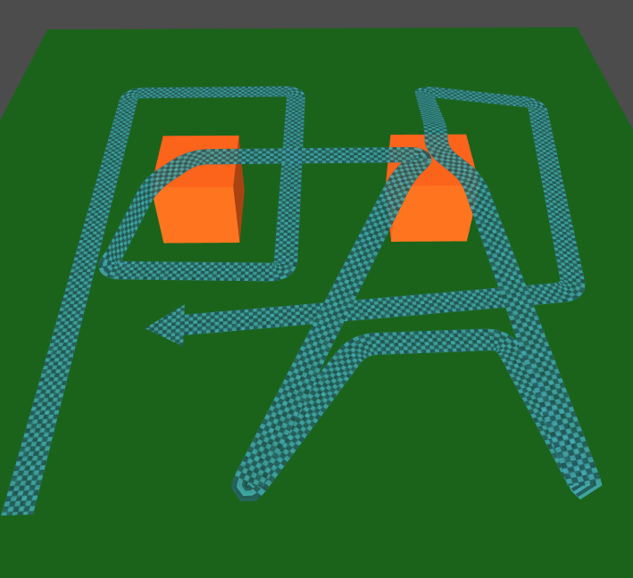

three.path
===================

three.path is a three.js extension which provides a 3D path geometry builder.

 

usage
===================
````javascript

var path3D = new THREE.Path3D();
var geometry = new THREE.PathGeometry();

// when begin a path
path3D.start(); 

// when mouse moving
path3D.update(mouse.x, mouse.y); 

// when drawing a point
path3D.confirm(); 

// when finish a path
path3D.stop(); 

// clear path
// path3D.clear(); 

// update geometry when path3D changed
geometry.update(path3D.getPathPointList(), {
    width: 0.3,
    uvOffset: 0
}); 

// or just update uv
geometry.updateUVScroll(offsetX, offsetY);

````