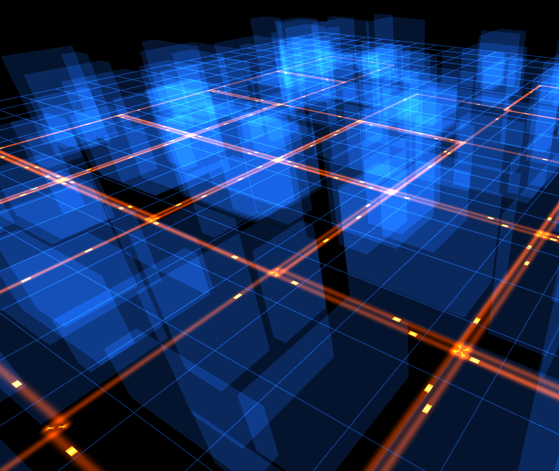

three.path
===================

three.path is a three.js extension which provides a 3D path geometry builder.

usage
===================

### Path3D

a helper class for path drawing

````javascript

var path3D = new THREE.Path3D();

// when begin a path
path3D.start(); 

// when mouse moving
path3D.update(mouse.x, mouse.y); 

// when drawing a point
path3D.confirm(); 

// when finish a path
path3D.stop(); 

// clear path
// path3D.clear(); 

// get the list
var pathPointList = path3D.getPathPointList();

````

### PathGeometry

 

path geometry build from pathPointList. ->> [tube](https://shawn0326.github.io/three.path/examples/index.html)

````javascript

var geometry = new THREE.PathGeometry();

// update geometry when pathPointList changed
geometry.update(pathPointList, {
    width: 0.3,
    arrow: true,
    progress: 1
});

````

### PathTubeGeometry

 

path tube geometry build from pathPointList. ->> [tube](https://shawn0326.github.io/three.path/examples/tube.html)

````javascript

var geometry = new THREE.PathTubeGeometry();

// update geometry when pathPointList changed
geometry.update(pathPointList, {
    radius: 0.1,
    radialSegments: 10,
    progress: 1
});

````

demo
===================

 

[City](https://shawn0326.github.io/three.path/examples/city.html)

build
===================

### first run

````
npm install
````

### build

````
npm run b
````